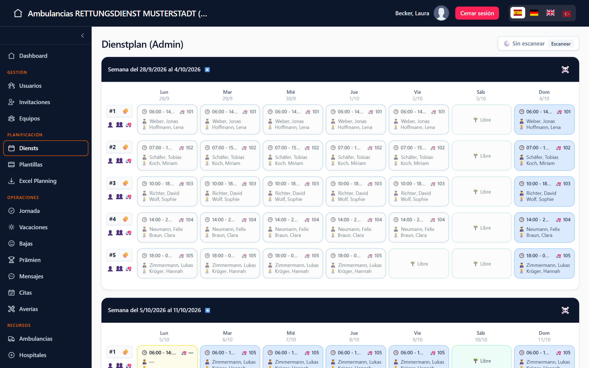
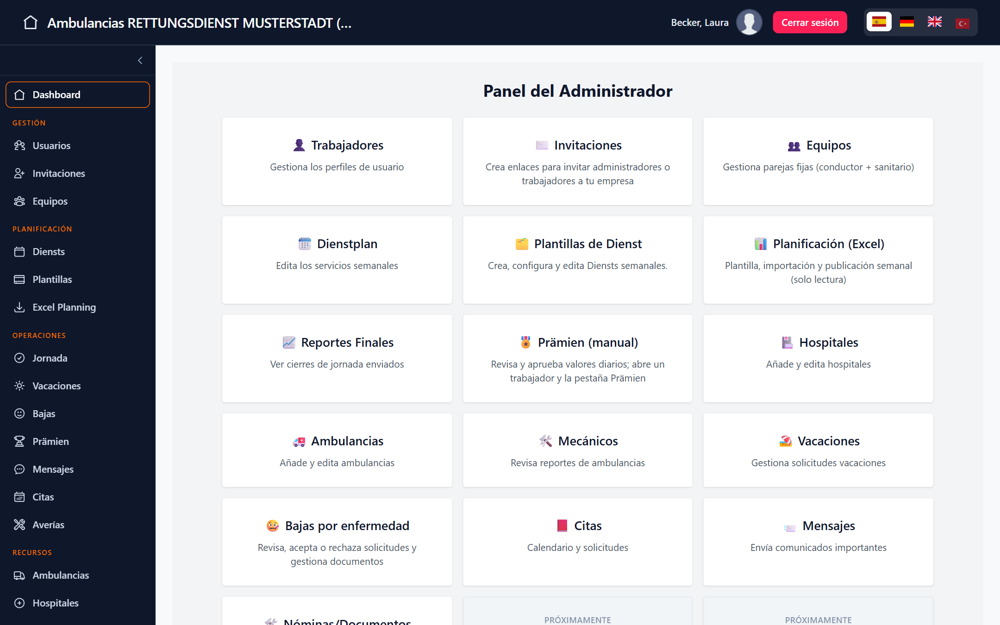
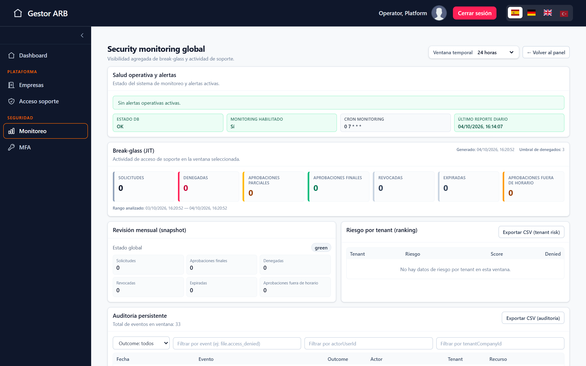
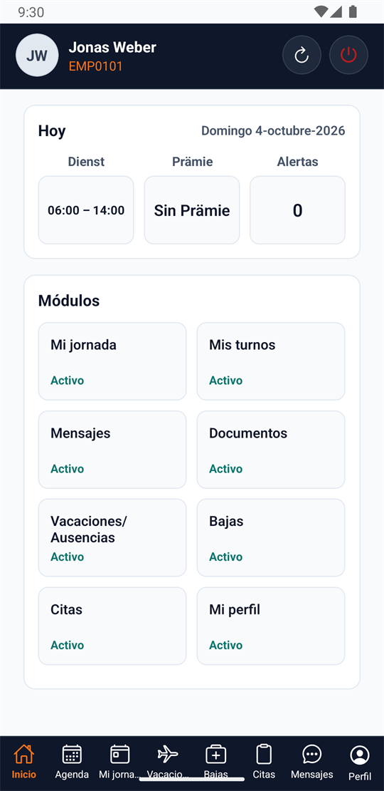
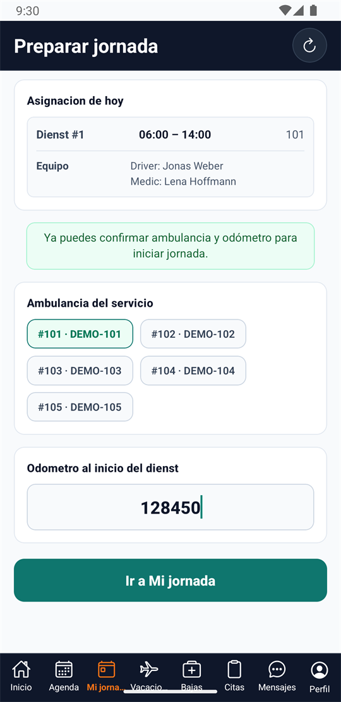
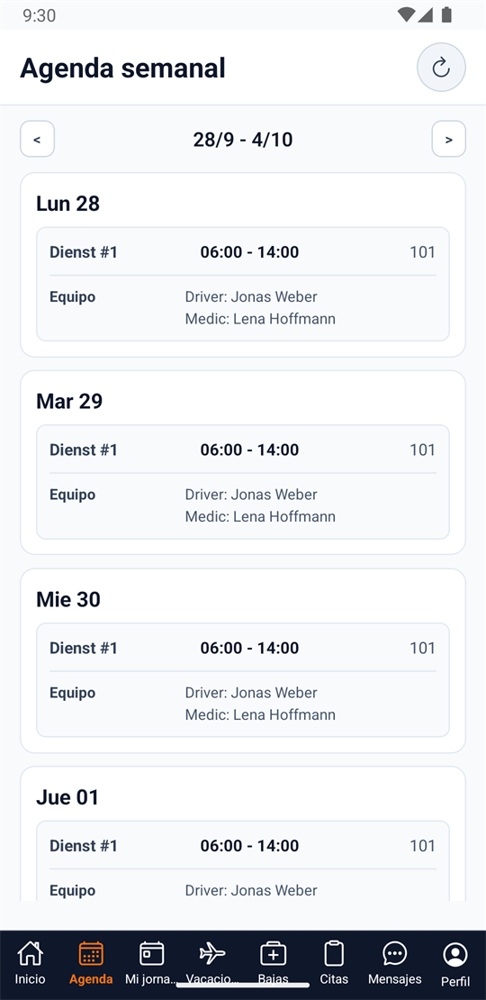
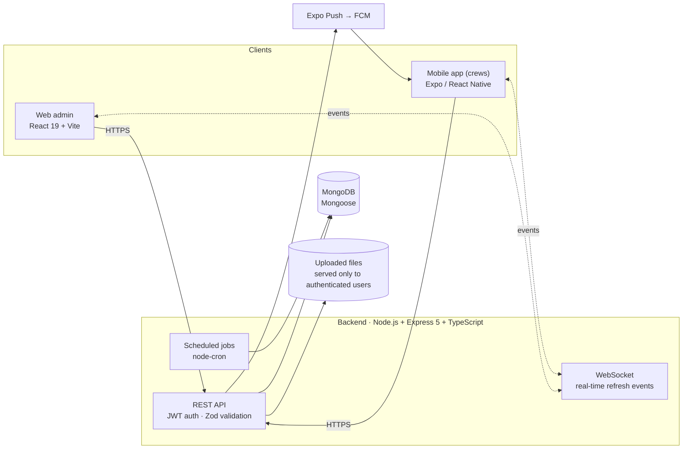

# Ambulancias GoRuiz

**Multi-tenant operations platform for ambulance and patient-transport companies** — web admin panel, mobile app for crews, and a REST + WebSocket API.

> **Project status: Archived · Not in production**
> The project reached an advanced functional development stage and was later deliberately archived before production deployment. It never had real customers or production users. The previously hosted development instances are being retired; the whole system can be rebuilt and run locally by following [docs/RECOVERY.md](docs/RECOVERY.md).


<sub>Weekly shift (Dienst) planning: teams, ambulances and shift times generated from templates with team rotation. All data shown is fictitious.</sub>

---

## What it is

Ambulance companies run on tight schedules: weekly duty rosters, two-person crews (driver + paramedic), vehicles, sick leave, holidays, documents and monthly bonuses. In many small companies this is handled with spreadsheets and messaging apps.

Ambulancias GoRuiz replaces that with one system:

- **Admins** plan shifts, manage crews, vehicles and absences, distribute documents and payslips, and review daily work reports.
- **Crew members** use a mobile app to see their agenda, record their working day and trips, request holidays, report sick leave and read company documents.
- **A platform operator (superadmin)** onboards companies and decides which modules each company uses.

Several companies (tenants) share one deployment, and each company's data is isolated from the others. The domain follows German ambulance-service terminology (*Dienst*, *Prämien*, *P-Schein*), and the UI is available in Spanish, German and English.

## Screenshots

| Admin dashboard | Superadmin security monitoring |
|---|---|
|  |  |

<sub>Captured from a local environment with fictitious demo data. UI shown in Spanish. The application also includes German and English localization; some interface strings remain untranslated and are documented as known technical debt.</sub>

### Worker mobile app

Crew members use an Expo / React Native app: today's shift at a glance, starting the workday (vehicle and odometer), and the weekly agenda.

| Home | Start of workday | Weekly agenda |
|:---:|:---:|:---:|
|  |  |  |

<sub>Android emulator, local backend, fictitious demo data.</sub>

## Main features

**Planning and operations**
- Weekly shift planning from reusable templates, with automatic team rotation, vehicle assignment and per-day schedules
- Import of weekly planning from Excel files (alternative to template-based planning)
- Mobile workday flow: start of day (vehicle and starting mileage), trips (pickup, destination, hospital), partial and final day closure
- Vehicle defect reporting and tracking for mechanics

**People and absences**
- Holiday requests with approval, rejection and alternative-date proposals
- Sick leave with document upload and admin review
- Medical appointments and internal messages with attachments

**Documents, payroll and bonuses**
- Company documents distributed to workers, with read acknowledgment tracking
- Payslip PDFs uploaded in batches and matched to workers by employee number in the file name (ambiguous files are never auto-assigned)
- Monthly bonus (*Prämien*) calculation: automatic from workday data or manual daily entries with admin approval, using configurable company rules

**Platform**
- Company onboarding and per-company module activation by the superadmin
- Security monitoring dashboard, audit log and time-limited support access with approval

## Architecture



- **Monorepo** with three independent applications that communicate only over HTTP and WebSocket.
- **Modular backend**: one folder per business domain (`src/modules/*`). Controllers parse requests, services hold business logic and enforce tenant boundaries.
- **Feature gating**: every company has a list of enabled modules, checked by middleware on each route.

```
ambulancias-goruiz-backend/    REST + WebSocket API (Express, Mongoose)
ambulancias-goruiz-frontend/   Web admin and superadmin panel (React, Vite, Tailwind)
apps/app-worker/               Mobile app for crew members (Expo)
docs/                          Technical documentation
scripts/                       CI helper scripts (secret scan, OpenAPI and smoke checks)
```

## Tech stack

| Layer | Technologies |
|---|---|
| Backend | Node.js 20, Express 5, TypeScript, MongoDB 6 + Mongoose 8, Zod, JWT, bcrypt, speakeasy (TOTP), ws, node-cron, Multer, Helmet, express-rate-limit |
| Web frontend | React 19, TypeScript, Vite 6, Tailwind CSS 4, React Router 7, Axios, i18next |
| Mobile | Expo SDK 54, React Native 0.81, Expo Notifications, Expo SecureStore |
| Testing | Jest + Supertest (integration tests against a real MongoDB), Vitest + Testing Library |
| Tooling / CI | GitHub Actions, Gitleaks, OpenAPI 3 spec, Prettier, ESLint |

## Technical highlights

- **Multi-tenant isolation.** Every admin operation is scoped by `companyId` in the service layer, with explicit handling for legacy records that predate the tenant field. A dedicated tenant-isolation test suite runs in CI on every pull request.
- **Security-focused backend.** Token versioning for session revocation, company resolved from the database instead of trusting the JWT, TOTP MFA and step-up re-authentication for critical superadmin actions, time-limited support access with approval, a persistent audit log and rate limiting on sensitive endpoints.
- **Private file handling.** Medical documents, PDFs and attachments are only served through an authenticated endpoint with ownership checks; the public uploads path is limited to images.
- **Real-time updates.** A WebSocket channel pushes minimal `{ event }` signals so the web panel and the mobile app refresh only what changed, without sending data over the socket.
- **One API, three clients.** The same backend serves the admin panel, the superadmin panel and the mobile app, with role-based access control (company admins, workers, mechanics and the platform superadmin).
- **Tested against a real database.** 893 backend tests (mostly integration tests with Supertest and MongoDB) and 432 frontend tests.

## Testing and quality

| Check | Status at archive time |
|---|---|
| Backend tests (`npm run test:full`) | 893 / 893 passing |
| Frontend tests | 432 / 432 passing |
| TypeScript typecheck (backend, web, mobile) | Passing |
| CI (build, tenant-isolation tests, backend smoke test, secret scan) | Passing |
| Frontend lint | Runs; reports pre-existing findings (mostly `no-explicit-any`) |

Known limitations and technical debt are documented in [docs/KNOWN-ISSUES.md](docs/KNOWN-ISSUES.md).

## Running locally

Requirements: Node.js 20 (see `.nvmrc`), npm 10, MongoDB 6 running as a replica set.

```bash
npm ci --prefix ambulancias-goruiz-backend
npm ci --prefix ambulancias-goruiz-frontend
# create ambulancias-goruiz-backend/.env and ambulancias-goruiz-frontend/.env from their .env.example files
npm run dev:backend      # API on http://localhost:5000
npm run dev:web-admin    # web panel on http://localhost:5173
```

No external services are required to run the backend and web panel locally. The full step-by-step guide — database setup, first superadmin, demo data, tests, the mobile app and how to redeploy every service — is in **[docs/RECOVERY.md](docs/RECOVERY.md)**.

## Development approach

I designed and built this project end to end: product scope, domain model, architecture, security model, implementation, testing and review. During parts of the development I used AI-assisted coding tools. They worked under project rules I defined for architecture, tenant isolation, file security and testing (see `CLAUDE.md` and `.cursor/rules/`), and every change went through my own validation and review.

## Documentation

| Topic | Document |
|---|---|
| Restore and run the project | [docs/RECOVERY.md](docs/RECOVERY.md) |
| Architecture | [docs/ARCHITECTURE.md](docs/ARCHITECTURE.md) |
| Authentication and roles | [docs/AUTH.md](docs/AUTH.md) |
| Multi-tenant model | [docs/MULTI-TENANT.md](docs/MULTI-TENANT.md) |
| File security | [docs/FILE-SECURITY.md](docs/FILE-SECURITY.md) |
| Modules overview | [docs/MODULES-OVERVIEW.md](docs/MODULES-OVERVIEW.md) |
| Known issues | [docs/KNOWN-ISSUES.md](docs/KNOWN-ISSUES.md) |
| Full index | [docs/README.md](docs/README.md) |

Detailed technical documentation is written in Spanish.

## License

© 2025–2026 Antonio Ruiz Brocal. Source available for portfolio and evaluation purposes. No license is granted to use, copy, modify or distribute this code.
